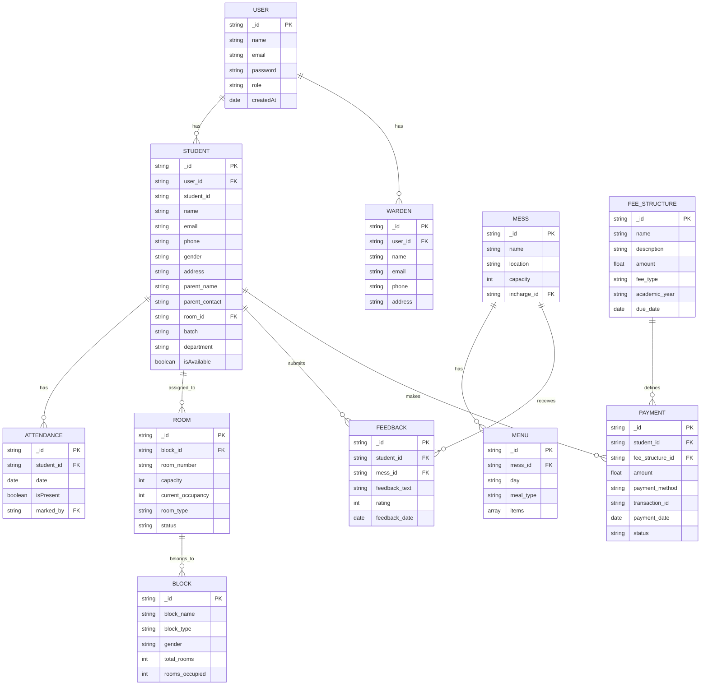

# Hostel Management System - ER Diagram

## How to View the Diagram
1. Copy the Mermaid code above
2. Use any Mermaid-compatible viewer like:
   - [Mermaid Live Editor](https://mermaid.live/)
   - VS Code with Mermaid extension
   - GitHub/GitLab Markdown viewer (native Mermaid support)

## Key Relationships
1. **USER** is a parent entity with STUDENT and WARDEN as child entities (inheritance)
2. **STUDENT** is assigned to a ROOM
3. **ROOM** belongs to a BLOCK
4. **STUDENT** has multiple ATTENDANCE records
5. **MESS** has multiple MENU items and receives FEEDBACK
6. **STUDENT** makes PAYMENT according to FEE_STRUCTURE
